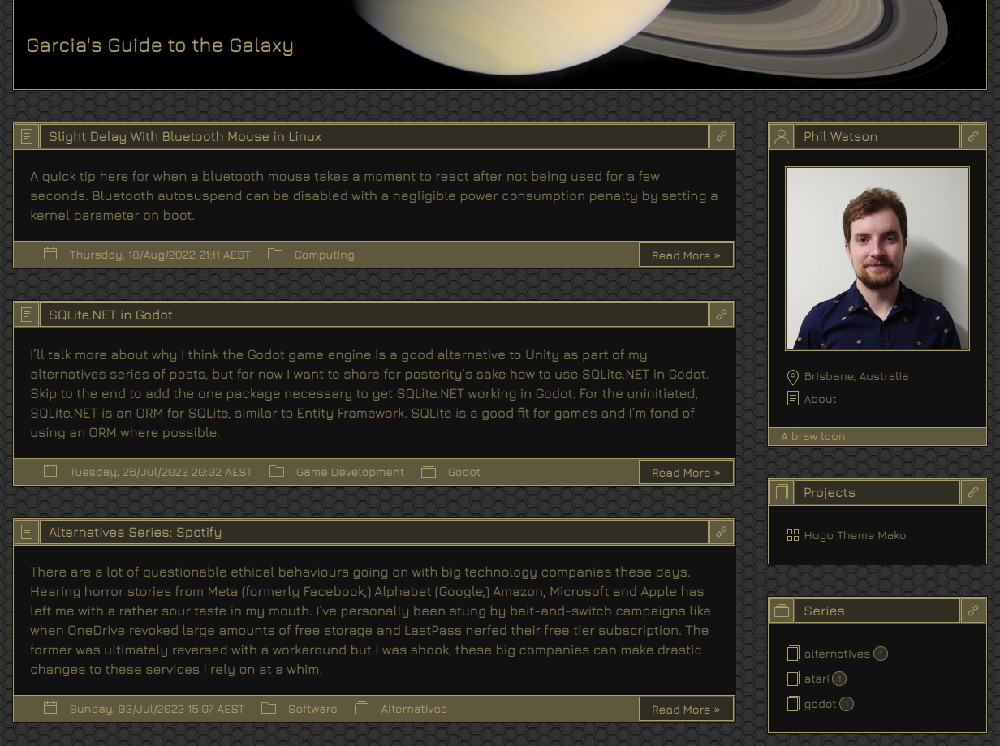

# hugo-theme-mako
Mako theme for [Hugo](https://gohugo.io/), a retro computing inspired theme built upon [UI-Kit](https://getuikit.com).



## Installation
If your site is configured for Git already, add this repo to the `themes/` directory as a submodule:

``` bash
git submodule add https://github.com/Eraph/hugo-theme-mako.git themes/mako
```

Otherwise clone it:

``` bash
git clone https://github.com/Eraph/hugo-theme-mako.git themes/mako
```

And set the theme in your site's config file:

``` toml
theme = "mako"
```

## Configuring
### Basic Configuration

Set the following params as you see fit:

``` toml
[params]
  author = "My Name"  # Put your name in here
  pronouns = "He/Him"  # Optional pronouns that are displayed immediately below your avatar
  profilePicture = "path/to.image"  # Path to your profile picture, e.g. "images/avatar.jpg"
  location = "New York City, USA" # Optional location indiciator, shows below your profile picture
  description = "Something About This Site" # Appears under your profile picture
  sections = ["projects"] # List any sections to be displayed in the sidebar
  navigation_taxonomies = [ "series", "categories" ]  # List any taxonomies to be displayed in the sidebar
  sidebar = "left"  # This moves the sidebar to the left. By default it is on the right
  dateFormat = "02/Jan/2006 15:04 MST"  # How to format dates. See the note below before changing this.

  [params.theme]
  titleBackgroundImage = "images/bg.jpg" # Optional background image for the title bar
  font = "Jura" # Optional Google font, defaults to [Jura](https://fonts.google.com/specimen/Jura). See notes below.

  # Theme custom colours; see below for more information
  primary = "#fc0"
  secondary = "#960"
  background = "#090909"
```

Many of these settings have defaults so it's not critical that you set them.

### Date Formats
The value you enter here must be very specific. Use the exact values as in the following example, rearranged as you need them:

```
02/Jan/2006 15:04 MST
```

For example, to have a simple date in the American style, set this to:
```
01/02/06
```

Note that in both cases the date is the 2nd of January 2006. Check out [Hugo's Documentation](https://gohugo.io/functions/format/#gos-layout-string) for more information.

### Taxonomies
The taxonomies `series` and `categories` are treated as special cases and are given special icons. Why? Because I wanted them to! You can muck about with taxonomies and their corresponding icons by getting yoru hands dirty with the theme. Look at the `get_icon.html` partial view, and refer to [UI-Kit's Documentation](https://getuikit.com/docs/icon) for help with icons.

### Custom Font
Take a look at the [Google Fonts](https://fonts.google.com/) site and find a font you like. Copy the name as-is and paste it into your config under `[params.theme]` as above. Too easy!

### Taglines
The footer of the site summary panel (where your profile picture appears) will contain the `description` as specified in config params by default, but can be set to a random entry from a list by adding a `taglines` array to your config params.

``` toml
[params]
  taglines = [
    "A cool website",
    "A really neat website",
    "Your new favourite blog"
  ]
```

Of course, Hugo is a static site generator so the tagline will not change on each refresh but it will change for each page whenever the site is regenerated. Fill this up with silly quotes and see how it affects different pages around your site.

## Custom Colours
It is possible to set a primary, secondary and background colour to set up your own colour scheme. Secondary is optional and if not set will default to halfway between the primary and background colours. Have a look at the following example for inspiration. I'm sure you can come up with better schemes than I can.

### Mako (default)

``` toml
primary = "#0f9"
secondary = "#099"
background = "#090909"
```

### Toothpaste

``` toml
primary = "#0fc"
secondary = "#099"
background = "#f7f7f7"
```

### Mustard

``` toml
primary = "#fc0"
secondary = "#960"
background = "#090909"
```

### Bronze

``` toml
primary = "#aa9e6b"
background = "#111"
```

### Grey Light

``` toml
primary = "#000"
background = "#fff"
```

### Grey Dark

``` toml
primary = "#fff"
background = "#000"
```

### Nier

``` toml
primary = "#4e4b42"
background = "#dad4bb"
```

### Ragnarok

``` toml
primary = "#f90"
secondary = "#c00"
background = "#000"
```

### Hacker

``` toml
primary = "#0f0"
secondary = "#033"
background = "#000"
```

### Cyberpunk

``` toml
primary = "#f09"
secondary = "#036"
background = "#000"
```

## Navigation Lists
### Pages and other sections
Pages in the `pages` directory will be listed in the site summary panel under your profile picture. Add a page with:

``` bash
hugo new pages/my-page-name.md
```

Add the front matter parameter `order` (integer) to set the order of pages in the list. The order is smallest at the top to largest at the bottom.

Specify other sections in `config.toml` as an array, e.g.
``` toml
sections = ["projects"]
```

### Taxonomies
All tags are shown by default at the bottom of the navigation bar. Other taxonomies can be shown above them by specifying them in the `navigation_taxonomies` array in `config.toml`, for example:

``` toml
navigation_taxonomies = [ "series", "categories" ]
```

## Contributing

Contributions are welcome by way of pull requests.

Please let me know if there are any gaps in the theme's coverage by [raising an issue](https://github.com/Eraph/hugo-theme-mako/issues/new).

## License

This theme is released under the [**MIT**](/LICENSE) License.